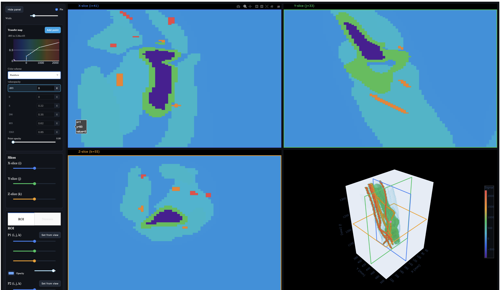

# FakeCT — Minimal synthetic CT / voxelization toolkit

These instructions show how to load a mesh, voxelize it into a CT-like grid,
create in/on/out masks and inspect the result with a simple viewer.

This README includes instructions for installing prerequisites (VS Code, Git, Conda),
cloning the repo, creating an environment, installing runtime dependencies, and running the demo.

## Current Version


## Next Version - Stenosis Tool


## Your Tasks:
```bash
1- Install the prerequisites
2- Follow the quick start to try the demo examples: cube, sphere, carotid, and the bundled VTI sample
```

## Prerequisites

Before following the quick start, make sure you have these tools installed. The setup is almost the same on macOS,
Windows, and Linux once Git and Conda are available; the main differences are how you install those two tools and
which terminal you use.

- Visual Studio Code — editor and debugging UI
	- Website: https://code.visualstudio.com/
	- Install using the official installer for macOS, Windows, or Linux.
	- Optional macOS Homebrew command:

		```bash
		brew install --cask visual-studio-code
		```

- Git — version control
	- Website: https://git-scm.com/
	- macOS options:

		```bash
		# Install Xcode command-line tools (includes git)
		xcode-select --install

		# or via Homebrew
		brew install git
		```

	- Windows: install Git for Windows from https://git-scm.com/download/win. After installation, use Git Bash,
	  PowerShell, Command Prompt, or the VS Code terminal.
	- Linux: install Git with your distribution package manager. For example:

		```bash
		# Debian/Ubuntu
		sudo apt install git

		# Fedora/RHEL-style distributions
		sudo dnf install git
		```

- Conda (Miniconda recommended) — environment and package manager
	- Miniconda install guide: https://www.anaconda.com/docs/getting-started/miniconda/install
	- Conda install overview: https://docs.conda.io/projects/conda/en/latest/user-guide/install/index.html
	- macOS options:

		```bash
		# Option 1: official graphical or terminal installer from the Miniconda guide

		# Option 2: Homebrew
		brew install --cask miniconda
		conda init zsh
		exec $SHELL
		```

	- Windows: use the Miniconda graphical installer from the install guide. Then open "Anaconda Prompt" or
	  "Miniconda Prompt" and run the quick-start commands below. If you want to use PowerShell instead, run
	  `conda init powershell` once, close the terminal, and open it again.
	- Linux: use the Miniconda Linux terminal installer from the install guide. After installation, initialize Conda
	  for your shell, then close and reopen the terminal. Common examples:

		```bash
		conda init bash
		# or, if you use zsh
		conda init zsh
		```

	If you prefer Anaconda, use the Anaconda installer instead. Follow the official installer pages for platform-specific guidance.

## Quick start

1. Clone the repository:

```bash
git clone https://github.com/aghcv/FakeCT.git
cd FakeCT
git switch phantom
```

2. Create and activate a Conda environment:

```bash
conda create -n fakect python=3.10 -y
conda activate fakect
```

3. Install the runtime dependencies:

```bash
conda install -c conda-forge numpy scipy scikit-image python-igl trimesh plotly dash -y
```

If you prefer a pip-based environment for the pure Python packages, use:

```bash
pip install --upgrade pip
pip install numpy scipy scikit-image trimesh plotly dash
```

`igl`/`python-igl` is required for STL mesh voxelization and is typically easiest to install from `conda-forge`.
Use the conda path above for the class examples unless you already know how to install `igl` in your pip environment.
After activating the conda environment, use `python` for the commands below. On macOS, `python3` may point to the system Python instead of the conda environment.

python -m pip install libigl==2.5.1

4. Run the demo:

```bash
# cube
python src/fakect.py --in data/cube.stl --n 8 --out outputs

# sphere
python src/fakect.py --in data/sphere.stl --n 8 --out outputs

# carotid
python src/fakect.py --in data/carotid.stl --n 8 --margin 0.10 --out outputs
```

To skip opening the Dash viewer, add `--no-show`.

`--out` now expects a directory path. The tool auto-generates an NPZ filename from the input name (for example, `cube_masks.npz` or `vti_masks.npz`) inside that directory.
`--n` controls the grid size as `2^n` voxels per side. The examples above use `--n 8` for a 256 x 256 x 256 grid; use `--n 7` for a faster first smoke test.

You can inspect the available CLI options with:

```bash
python src/fakect.py --help
```

## VTI Import Test

You can start testing VTI import now. The CLI supports both a single `.vti` file and a directory of tiled `.vti` files.

The bundled `data/arm.vti` file is `CellData` named `activity` with `Float32` values from about
`-893` to `2263`. With the default `--vti-max-labels 64`, the tool treats it as scalar/range data
and saves both a non-background occupancy mask and the sampled value volume as `scalar_values`.

```bash
# Bundled single VTI sample
python src/fakect.py --in data/arm.vti --out outputs --no-show --vti-max-dim 64

# Development fixture used for smoke checks
python src/fakect.py --in tests/activity_grid_000_001_005.vti --out outputs --no-show --vti-max-dim 64

# Directory import is also supported for your own tiled VTI folders.
# Replace path/to/vti_tiles before running this pattern:
# python src/fakect.py --in path/to/vti_tiles --out outputs --no-show --vti-max-dim 64
```

Useful VTI-specific flags:

```bash
--vti-array <name>          # choose a DataArray by name
--vti-background <value>    # set the background label/scalar value
--vti-background-eps <eps>  # tolerance for floating-point background matching
--vti-max-dim <int>         # browser-friendly downsampling cap (0 = full resolution)
--vti-max-labels <int>      # max number of discrete labels split into layers
```

In the 3D panel, discrete integer-label VTI files use per-label visibility and opacity controls.
Scalar/range VTI files use a ParaView-style transfer map: choose one color scheme for the full
range, add or remove opacity points, type exact opacity values, and drag points horizontally on the
map to reposition them.

Example VTI import interface:



By default the Dash viewer opens with three orthogonal slices and a linked 3D view. Use `--no-show`
for a headless import/export smoke test.

## Developer instructions (make changes & run tests)

1. Make code changes in `src/fakect.py` using your editor of choice.

2. There is currently no automated Python test suite in this repository. The `tests/` directory contains a VTI fixture for smoke checks. Use the CLI directly to validate changes:

```bash
python src/fakect.py --in data/cube.stl --n 8 --out outputs --no-show
python src/fakect.py --in data/arm.vti --out outputs --no-show --vti-max-dim 64
```

3. If you change runtime dependencies, update this README with the revised install command.

4. To try your changes interactively, run `python src/fakect.py --help` or one of the demo commands above.

5. Linting and formatting are not configured in this repository yet. If you add them later, document the commands here.

## Continuous integration (notes for maintainers)

- There is no CI workflow in the current repository state.
- Recommended CI steps:
	- Set up a Python 3.10 runner
	- Install the runtime dependencies listed above
	- Run `python src/fakect.py --help` as a smoke test
	- Run a headless STL smoke test with `data/cube.stl`
	- Run a headless VTI smoke test with `tests/activity_grid_000_001_005.vti`
	- Add targeted automated tests before relying on CI for behavior changes

## Contact / contributing

Open an issue or submit a pull request. Keep changes small and add tests for new behavior.

---
Small, clear, and focused so students can follow the flow from clone → run → edit → test.

# Relevant Papers 
Douglass, M. J. J., et al. (2025). “An open-source tool for converting 3D mesh volumes into synthetic DICOM CT images for medical physics research.” (LINK:https://doi.org/10.1007/s13246-025-01599-x)
