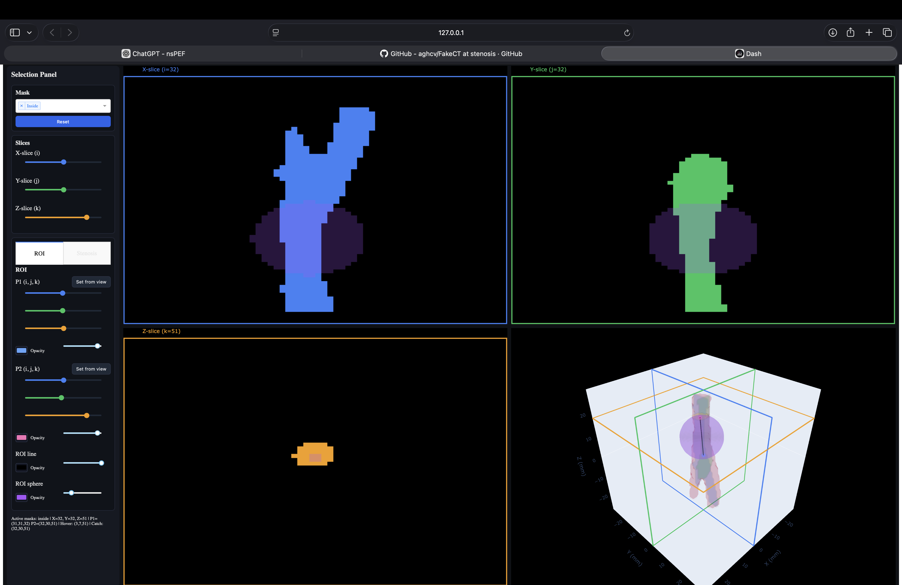
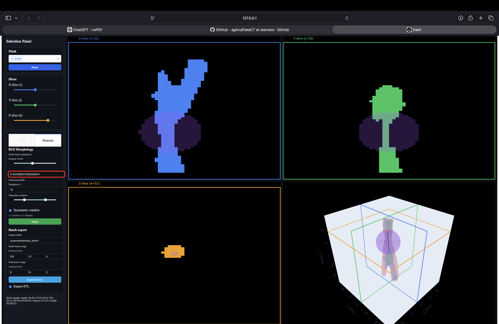
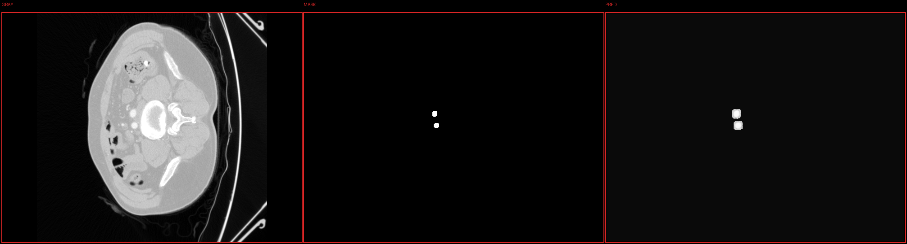
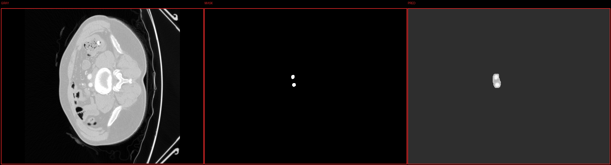
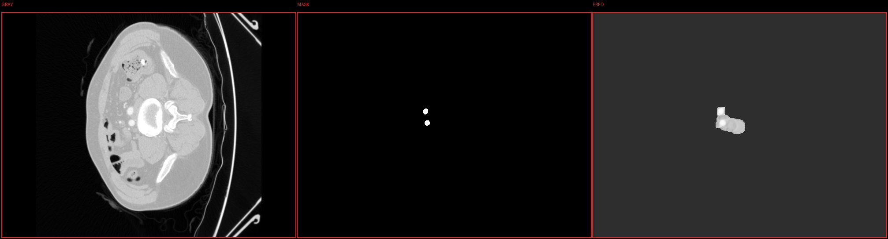

# FakeCT — Minimal synthetic CT / voxelization toolkit

Instructions shows how to load a mesh, voxelize it into a CT-like grid,
create in/on/out masks and inspect the result with a simple viewer.

This README includes instructions for installing prerequisites (VS Code, Git, Conda),
cloning the repo, creating an environment, installing the package (editable), and running the demo.

<!--
## Current Version


## Next Version - Stenosis Tool

-->


## fakect.py ROI workflow (interactive masks)
These examples show how `fakect.py` supports ROI creation for bitwise morphology manipulation.






## fakenoise.py training previews (context + context step)
These previews show how `fakenoise.py` trains across context settings to generate grayscale images from a slice neighborhood around the target mask.

Default context (single target mask slice):


`--context 4 --context_step 1`:


`--context 4 --context_step 10`:



## Your Tasks:
```bash
1- Install the prerequisites
2- Follow the 4 steps of the quickstart guideline to try demo exmaples: demo_cube, demo_sphere, and demo_carotid 
3- Identify user inputs you think is needed needed for the stenosis tool
```

## Prerequisites

Before following the quick start, make sure you have these tools installed. The links go to official installers and the one-liners work on macOS (zsh).

- Visual Studio Code — editor and debugging UI
	- Website: https://code.visualstudio.com/
	- macOS (Homebrew):

		```bash
		brew install --cask visual-studio-code
		```

- Git — version control
	- Website: https://git-scm.com/
	- macOS one-liners (choose one):

		```bash
		# Install Xcode command-line tools (includes git)
		xcode-select --install

		# or via Homebrew
		brew install git
		```

- Conda (Miniconda recommended) — environment and package manager
	- Miniconda: https://docs.conda.io/en/latest/miniconda.html
	- macOS (Homebrew) one-liner:

		```bash
		brew install --cask miniconda
		# initialize conda for zsh and reload your shell
		conda init zsh
		exec $SHELL
		```

	If you prefer Anaconda, use the Anaconda installer instead. Follow the official installer pages for platform-specific guidance.

## Quick start

1. Clone the repository:

```bash
git clone https://github.com/aghcv/FakeCT.git
cd FakeCT
```

2. Create and activate the Conda environment (uses `environment.yml`):

```bash
conda env create -f environment.yml
conda activate fakect
```

3. Install the package in editable/development mode and the minimal runtime deps:

```bash
pip install -e .
```

This installs the project as the `fakect` package and the `fakect` command-line entrypoint.


4. Run the demo:

```bash
# run the demo_cube script (runs the pipeline with predefined args)
fakect example demo_cube

# list of example scripts is in the `examples/` folder (demo_cube, demo_carotid, demo_sphere)
```

If you prefer to run the script directly from shell:

```bash
bash examples/demo_cube.sh
```

Note on demo meshes:

Example scripts expect demo geometry to live in the repository-global `data/` folder
at the repository root. To populate that folder with small demo meshes, run:

```bash
# from repo root
python scripts/generate_demo_meshes.py
# This writes: data/cube.stl, data/sphere.stl, data/carotid.stl
```

By default the demo will pop up a small matplotlib-based viewer showing three orthogonal
slices and a sparse 3D proxy of boundary voxels.

## Script usage examples

### fakect.py (winding-based masks + viewer)

Run the pipeline directly (from repo root):

```bash
python src/fakect.py --in data/cube.stl --n 8 --out outputs/cube_masks.npz
```

Run without opening the viewer (headless):

```bash
python src/fakect.py --in data/carotid.stl --n 9 --margin 0.10 --out outputs/carotid_masks.npz --no-show
```

### fakenoise.py (NRRD viewer + paired dataset CSV)

Open a web-based viewer for a single NRRD volume:

```bash
python src/fakenoise.py --mode viewer --in /path/to/volume.nrrd
```

Generate a CSV that pairs grayscale volumes with their `.seg.nrrd` masks
and uses the sagittal (X) slice index for training:

```bash
python src/fakenoise.py --mode pair --dataset-dir /path/to/dataset_root
```

This writes `paired_datasets/pairs.csv` under the dataset root and saves one
example PNG preview (gray left, mask right) in the same folder.

Train a mask-to-gray model using single-slice masks:

```bash
python src/fakenoise.py --mode train --csv /path/to/dataset_root/paired_datasets/pairs.csv
```

Train with context slices (stack neighbor masks as extra channels):

```bash
python src/fakenoise.py --mode train --csv /path/to/dataset_root/paired_datasets/pairs.csv --context 4
```

Train with context + stride (skip slices between neighbors):

```bash
python src/fakenoise.py --mode train --csv /path/to/dataset_root/paired_datasets/pairs.csv --context 4 --context-step 3
```

## Developer instructions (make changes & run tests)

1. Make code changes in `src/fakect/` using your editor of choice.

2. Run the unit tests with pytest. The project includes a small placeholder test so you can
	 validate the test/CI pipeline:

```bash
# from the repo root, with the venv activated
pytest
```

3. If you change package metadata or dependencies, update `pyproject.toml`.

4. To try your changes interactively, install the package in editable mode (step 3 above)
	 so that imports pick up the local source without reinstalling.

5. Linting and formatting (recommended):

```bash
black src tests
flake8
isort src tests
```

## Continuous integration (notes for maintainers)

- The `tests/` directory contains the unit tests. The placeholder test ensures the CI pipeline
	can run; expand the tests as you add features.
- Recommended CI steps:
	- Set up a Python 3.10 runner
	- Create a virtual environment and install `pip install -e .[dev]`
	- Run `pytest` and optionally `pytest --cov` for coverage
	- Run linters (black/flake8/isort)

## Contact / contributing

Open an issue or submit a pull request. Keep changes small and add tests for new behavior.

---
Small, clear, and focused so students can follow the flow from clone → run → edit → test.

# Relevant Papers 
Douglass, M. J. J., et al. (2025). “An open-source tool for converting 3D mesh volumes into synthetic DICOM CT images for medical physics research.” (LINK:https://doi.org/10.1007/s13246-025-01599-x)
