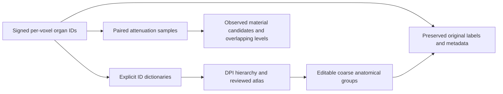

# Reversible tissue grouping from the DPI atlas

The integration branch now has an executable tissue-mapping layer:
`python3 scripts/prepare_tissues.py`. It reads pinned DPI classification documents,
joins explicit signed XCAT IDs to anatomical names, groups anatomy under a versioned
policy, and profiles attenuation from the previously collected paired XCAT samples.
This implements the label-grouping part of M1; GUI integration and cohort editing
remain later milestones.

The [ROI preview workbench](ROI_PREVIEWS.md) now reads a commented INI file and
produces one standalone HTML report containing full-resolution ROI close-ups,
neighboring z levels, transparent interactive 3D, selection tables and provenance.
It supports tissue-only selection inside a sphere or variable-radius tube. The
[DPI currency check](integration/2026-09-16/DPI_ATLAS_CURRENCY.md) confirms that the
pinned source atlas matches the latest accessible local DPI source and v6 campaign.

## Keep anatomy and material separate

The source atlas is useful, but a surface's anatomical boundary does not always name
the material occupying its voxel label. In the supplied data, body/skin-boundary labels
have adipose attenuation; some negative skull-interior labels have red-marrow
attenuation. Arteries and veins can share the same blood attenuation. A range alone
therefore cannot reliably recover the original anatomy.



Keep three linked representations: original anatomical IDs, an optional coarse grouping
view, and scalar/material evidence. No code here replaces the original labels or
claims that a bone-associated boundary is necessarily mineralized bone. Re-grouping
or selecting a finer subtype uses the preserved original voxel array, not an attempted
inverse of the many-to-one category map. Geometry edits will additionally need an
explicit original-organ ownership rule for newly claimed voxels.

## Proposed vocabulary

The editable [policy](../configs/tissues/tissue-policy.v1.json) defines ten groups.
For a reviewed change, copy the policy to a new filename, increment its version, and
regenerate the catalog from preserved originals rather than modifying a released view:


| ID | Group |
|---:|---|
| 1 | soft_tissue |
| 2 | bone |
| 3 | cartilage |
| 4 | muscle (including explicitly identified myocardium/papillary muscle) |
| 5 | artery |
| 6 | vein |
| 7 | lung |
| 8 | adipose |
| 9 | nervous_tissue |
| 10 | fluid |

`0` is reserved background; `255` is unresolved. These are proposed anatomical groups,
not validated material ground truth. No current atlas name maps directly to adipose
under this conservative policy, although measured attenuation supplies adipose
candidates for several anatomical groups. Unresolved heart chambers, inner/outer bone
boundaries and contradictory evidence remain unknown. Explicit review guards catch
known broad-regex collisions (`musc104` matching a vertebra pattern and `bladder_inner`
matching the coronary abbreviation LAD). They retain the source hierarchy as evidence
rather than silently correcting it. Classification retains the
original hierarchy and reason for review, so the vocabulary can be revised without
losing anatomical distinctions.

## Source evidence and matching

- [Pinned DPI documents](../references/atlas/dpi/SOURCE.json): source atlas CSV,
  explicit hierarchy YAML, and cardiovascular role atlas/README. The cardiovascular
  role atlas is retained as reference; it is not treated as a numeric voxel dictionary.
- [Pinned XCAT dictionaries](../references/atlas/xcat/SOURCE.json): original dictionary
  plus `high_res/040/organ_ids.txt`. Their 3,083 shared IDs have identical names.
  The union has 3,165 signed IDs and resolves 30 of the previous 41 missing IDs.
  Eleven sampled negative IDs remain absent; no sign/ordinal/nearest-ID inference is made.
- DPI's source CSV has 459 rows. Thirty-seven malformed cardiac rows have a column-count
  mismatch; they are preserved and reported but excluded as overrides. This intentionally
  differs from DPI's permissive loader. Well-formed blank review actions are accepted,
  and pending/rejected/unrecognized actions are not applied as overrides.
- The Python adapter implements the **explicit** YAML aliases/rules and valid CSV
  overrides; it is not a complete port of DPI's additional C++ built-ins. Independent
  comparisons to the native classifier document the conservative differences.
- Scoped overrides require actual DPI identity fields. `example_source_file` is provenance,
  not a matching condition. A `.raw` per-file ordinal is never used as a DPI global index
  or an `act` ID. If scoped alternatives agree only on artery/vein grouping, a tissue
  consensus is allowed while the exact hierarchy remains unresolved.
- Exact raw-name matches retain **all** candidate signed IDs. Repeated names do not
  establish a particular fragment-to-voxel correspondence. The surface catalog preserves
  each occurrence, source file, group, line, local index, candidate IDs and classification.
- The label catalog records hashes of dictionaries, atlas, hierarchy and policy.
  Summaries/profiles link to that catalog by hash, and the NPZ embeds it; keep the CSV
  and surface catalog companions with their label catalog. The original CSV rows,
  including review/evidence fields, remain accessible in classification records.
  Full source snapshots are in Git. No DPI source file was modified.

## Run the workbench

From the integration checkout, use a new output directory for each reviewed version:

```bash
python3 scripts/prepare_tissues.py catalog \
  --supplemental-organ-table references/atlas/xcat/organ_ids.040.txt \
  --raw-case-dir /home/aghorban/slurm/xcat/260602 --frame 1 \
  --out outputs/tissues/MY_ATLAS_VERSION

python3 scripts/prepare_tissues.py profile \
  --catalog outputs/tissues/MY_ATLAS_VERSION/label-catalog.json \
  --audit docs/integration/2026-09-16/xcat-results.json \
  --out outputs/tissues/MY_PROFILE_VERSION
```

`catalog` produces the complete `label-catalog.json`, reviewable membership CSV,
surface catalog, and summary. Defaults use the versioned source snapshots and policy.
Supplementary dictionaries are explicit arguments; conflicting names for one ID fail.
A six-file frame scan streams triangle lines without interpreting or loading the mesh
geometry. `--surface-inventory` can instead reuse a complete header inventory.

`profile` reuses the existing 12-case audit's exact paired label/attenuation level sets;
it does not scan the multi-terabyte volumes again. It outputs per-case/per-ID/group
levels and ranges, a CSV, a plot, shared levels across groups, unresolved IDs, and all
material candidates matching the log's rounded 1/cm coefficients. Source log hashes
are checked against the audit when available. It does not invent histogram frequencies,
quantiles, full-volume extrema or a universal tissue threshold from those level sets.
`--cases 260602` selects a pilot; `--no-plot` skips plotting.

The initial results are at `outputs/tissues/atlas-v1/` and
`outputs/tissues/atlas-profile-v1/`. Their compact, versioned evaluation is
[here](integration/2026-09-16/TISSUE_MAPPING_EVALUATION.md).

### Compare tissue groups on the original preview slices

The [tissue slice preview](integration/2026-09-16/xcat-tissue-preview.png) adds a
third row of categorical tissue views to the attenuation and original signed-ID
views. It uses the original preview's case 260602, frame 1, and crosshair
`i=375, j=375, k=1264`. The axial plane is full resolution; the whole-body context
uses every eighth k plane and every second in-plane voxel. Unknown/review labels
are magenta. Histograms describe the same 17-plane, ji-stride-8 sample grid as the
original preview, not full-volume counts. Native index and relative-mm axes are
shown; anatomical orientation remains unverified.

```bash
python3 scripts/evaluation/preview_xcat_tissues.py \
  --catalog outputs/tissues/atlas-v1/label-catalog.json \
  --case 260602 --frame 1 --crosshair-kji 1264 375 375 \
  --context-step 8 --inplane-step 2 \
  --out outputs/tissues/MY_TISSUE_PREVIEW.png
```

The JSON beside the PNG records the catalog/image/script hashes, source metadata,
sampling coordinates and group counts. Selected contiguous axial planes are read
once per channel, avoiding strided sagittal reads on NFS. Reducing the context
stride improves detail while increasing I/O; the decimated preview can omit thin
vessels. Original `.bin` files are opened read-only. Existing PNG/JSON output paths
are refused, so comparisons can be retained as separate versions.

For a bounded 3D label crop, provide its geometry explicitly and preserve both arrays:

```bash
python3 scripts/prepare_tissues.py reduce \
  --catalog outputs/tissues/MY_ATLAS_VERSION/label-catalog.json \
  --labels /path/to/original-labels.npy --geometry /path/to/geometry.json \
  --out outputs/tissues/MY_CROP_VIEW.npz
```

Geometry JSON must include `array_order: "zyx"`, matching `shape_zyx`, and three positive
`spacing_ijk_mm` values. Optional `crop_origin_ijk` and `source_shape_zyx` are bounds-checked.
Retain source origin/direction/status and any other metadata in the same JSON; the tool
preserves them but does not establish anatomical orientation from array dimensions.
The default maximum is 16,777,216 voxels. This NPZ command is for bounded crops, not a
full-volume cohort storage format. It refuses output overwrite. `--strict` rejects any
unresolved source ID/category; permissive preview keeps the original ID and displays
its group as 255. Integral float32 XCAT IDs are accepted; fractional, nonfinite and
out-of-int32-range values are rejected.

The NPZ contains `original_labels`, `tissue_labels`, and JSON with the geometry,
complete catalog and source hashes. A catalog by itself is insufficient to reconstruct
fine anatomy. For programmatic subdivision:

```python
from fakect_tissues import coarse_labels, subtype_mask
coarse = coarse_labels(original, catalog)
left_carotid = subtype_mask(original, catalog, tissue_id=5, original_ids=[1185])
```

## Next integration step

Expose this same catalog in the preview/GUI: choose a coarse group, expand its hierarchy,
select original labels or components, and inspect material evidence. Keep the single
signed label volume authoritative while rendering grouped views. Resolve the remaining
unknown IDs and malformed atlas rows in new versioned mapping documents before allowing
strict production edits. Add chunked volume export and tissue-weighted histograms when
the shared M1 import/preview adapter is implemented.
