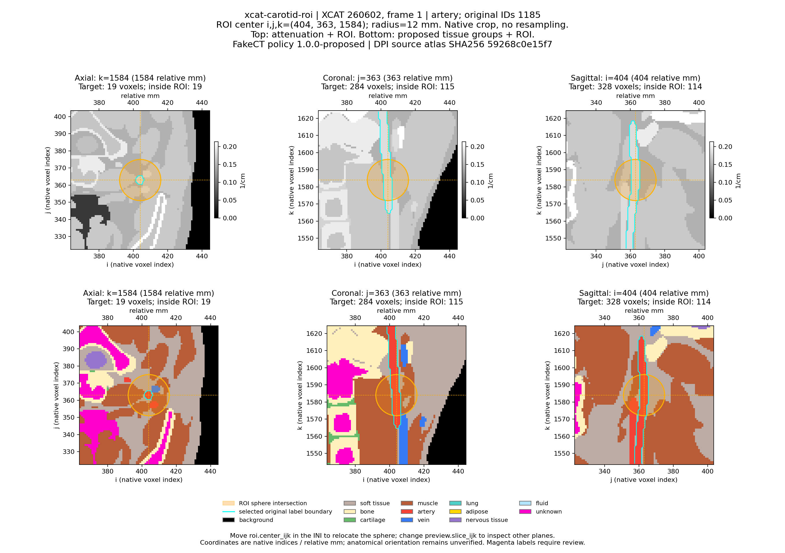
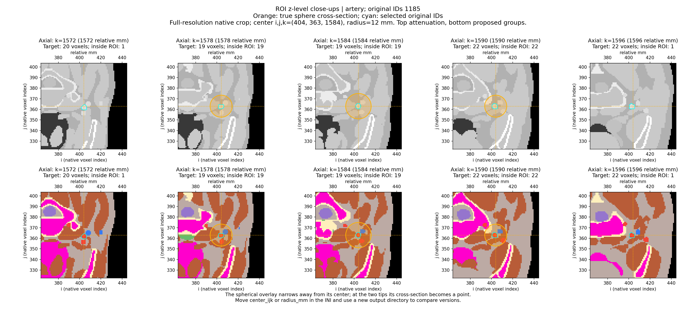
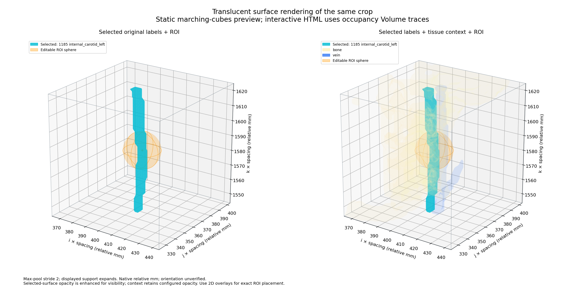

# ROI close-ups and transparent 3D evaluation

The [commented INI](../../../configs/examples/xcat-roi.ini) now drives the executable
[preview workflow](../../ROI_PREVIEWS.md). The full provenance is in
[roi-preview-results.json](roi-preview-results.json). This evaluation performs
selection and visualization; it does not apply dilation, erosion or reassignment.

| Item | Evaluated result |
|---|---|
| Source | XCAT case 260602, frame 1, paired act/atn |
| Selection | Original signed ID 1185, internal_carotid_left; artery group |
| ROI center, native i,j,k | 404, 363, 1584 |
| Physical radius | 12 mm |
| Crop | 81×81×81 = 531,441 native voxels; 1 mm spacing |
| Crop bounds | i `[364,445)`, j `[323,404)`, k `[1544,1625)` |
| Fine labels retained | 121 unique IDs; 29,235 negative-ID voxels |
| Selected vessel | 1,568 voxels in crop; 482 within ROI |
| Sphere membership | 7,153 native voxel centers |
| Unresolved grouped labels | 63,731 crop voxels; 5 within ROI |
| Missing dictionary IDs in crop | `-816`, retained unchanged |
| Crop reader | 81 contiguous axial planes/channel, 364,500,000 requested bytes total |
| Interactive 3D | Three binary-occupancy volume traces: selected vessel, bone, vein; ROI sphere overlay |
| 3D sampling | Stride 2 block maxima; 41³ display blocks, 43³ with zero border |
| Interactive file | Standalone HTML, 9,089,001 bytes; embedded Plotly JavaScript |
| Tests | 43 passed |

The orange region is the physical sphere's intersection with each slice. Cyan
outlines the explicitly selected original ID, while other arteries remain
distinguishable through their IDs in the preserved source. The top row is
attenuation in 1/cm and the bottom row is the proposed anatomical grouping.

The axial levels are k=1572,1578,1584,1590,1596. Their sphere sections narrow
toward the two tips. Native i,j,k coordinates are preserved under cropping;
anatomical orientation and absolute physical origin remain unverified.

The static figure separates the selected vessel and ROI from the contextual view
to keep the ROI visible. It uses marching-cubes surfaces. The separate interactive
`outputs/roi/carotid-v2/roi-volume.html` uses Plotly Volume traces, with rotation,
zoom, legend toggles and an opacity slider. Its JavaScript and trace/control
structure were verified; browser/WebGL interaction was not automated in this
headless environment. The PNGs were visually inspected.

Max-pooling in 3D preserves thin labels for display but can enlarge their support
or merge apparent gaps. It is not used for the native 2D slices, sphere membership,
saved source labels, or future geometry edits. Unknown labels remain visible; the
five unknown voxels inside this ROI must be handled by an explicit protected/
donor/recipient policy before notebook morphology can become a production edit.

## Verification

`python3 -m unittest discover -s tests -p 'test_*.py' -q` passed all 43 tests:
existing tissue/provenance checks plus strict INI validation, anisotropic sphere
geometry, crop bounds/axis order, source preservation, changed metadata, catalog
snapshot identity, 3D coordinates, thin-label occupancy, boundary closure, empty
selection discovery, zero opacity and standalone artifacts.

The saved label/scalar crop hashes match the freshly read arrays. Independent
single-voxel reads at the ROI center match both saved channels. The selected mask
contains only original ID 1185 and maps to artery group 5. Original labels,
attenuation, selection and sphere masks, geometry, and the complete catalog are
retained in `crop.npz`. Config/catalog snapshots and code/artifact hashes match the
recorded provenance. Unknown and negative IDs were not replaced.

The [DPI currency check](DPI_ATLAS_CURRENCY.md) found no newer applicable source
classification atlas in the local checkout or latest accessible v6 campaign.
Copies already match their actual provenance. The routing atlas was added as a
separate reference. Figure titles now distinguish FakeCT's `1.0.0-proposed`
grouping policy from the DPI source-atlas hash and cardiovascular atlas 1.1.0.

The earlier whole-body tissue figure was regenerated with clarified provenance;
its measured group counts are unchanged. The new INI replaces JSON as the human
preview input, while resolved machine metadata remains JSON. The original draft
cohort JSON remains a design reference; full edits, GUI roundtrip and population
generation remain later milestones.
