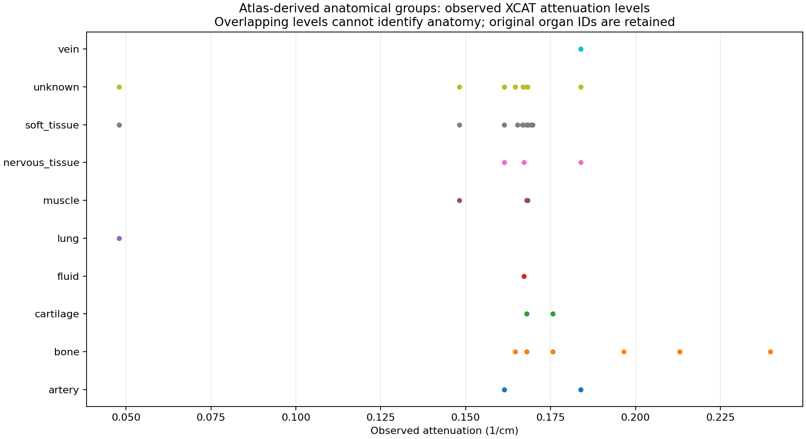

# DPI atlas tissue mapping — implemented evaluation

Implementation and commands: [tissue workbench](../../TISSUE_MAPPING.md).
Machine-readable evidence: [tissue-mapping-results.json](tissue-mapping-results.json).
The atlas, dictionaries, hierarchy and editable grouping policy are versioned in this
branch. Complete generated catalogs remain in `outputs/tissues/atlas-v1/`; paired
attenuation profiles are in `outputs/tissues/atlas-profile-v1/`.

## Result

The atlas supports a reversible coarse anatomical view, provided material evidence
is kept separate and uncertain matches remain visible.

| Evaluated item | Result |
|---|---|
| Explicit dictionary union | 3,165 signed IDs, plus reserved background 0 |
| Supplementary dictionary overlap | 3,083 shared IDs, zero name conflicts |
| Earlier dictionary gaps | 30 resolved; 11 still missing |
| Pilot raw surfaces | 2,634 occurrences, 912 distinct names, six complete files |
| Surface-to-ID name joins | 796 unique-name candidates; 1,838 ambiguous candidates; zero unmatched names |
| Atlas override issues | 37 malformed rows retained/quarantined |
| Category policy | 10 proposed anatomical groups, background and unknown sentinels |
| Catalog group outcomes | 2,772 signed IDs assigned a group; 393 retain unresolved/review status |
| Paired attenuation evidence | 1,779 observed IDs; 8,070 case/ID records across 12 cases, from existing bounded samples |
| Shared attenuation levels | 21 group pairs share at least one measured level |
| Real crop roundtrip | 32×64×64 = 131,072 voxels; all original signed ID values preserved exactly |
| Automated checks | 25 passing tests |

A unique-name candidate is not a geometric proof that a specific raw fragment
occupies those voxels. With repeated names, the catalog deliberately keeps all candidate
IDs and all surface occurrences. DPI global block ordinals and raw local indices are
never treated as voxel IDs.

## Tissue groups and uncertainty

| Group | Dictionary IDs |
|---|---:|
| soft_tissue | 369 |
| bone | 406 |
| cartilage | 52 |
| muscle | 413 |
| artery | 644 |
| vein | 775 |
| lung | 2 |
| adipose | 0 |
| nervous_tissue | 103 |
| fluid | 8 |
| unknown/review | 393 |

The policy describes anatomical grouping. An adipose *material* is present in the
measured volumes even though the conservative atlas name/hierarchy rules do not assign
an anatomical label directly to the adipose group. Inner/outer bone boundaries, heart
ambiguity, malformed/scoped/conflicting evidence and known broad-regex collisions are
not forced into a confident tissue assignment. `musc104`/vertebra and
`bladder_inner`/LAD substring collisions have explicit review guards and regression tests.

The points are measured **level sets**, not voxel-weighted frequencies. Intensities
were normalized using the case pixel width to 1/cm in the original audit. Per-case
log tables supply candidate material names at their printed rounding precision;
multiple matching names remain alternatives. No histogram frequencies, quantiles,
full-volume extrema, HU calibration or universal category thresholds are inferred.

Examples show why source anatomy and material cannot be merged into one irreversible
label: `chest_surface` has adipose attenuation, `right_dia` can also have adipose
attenuation, skull-interior labels can have marrow attenuation, and artery/vein
labels share iodine-blood attenuation. Some nervous hierarchy labels also carry
blood attenuation; their anatomy/material interpretation remains reviewable rather
than being reassigned from intensity alone.

Eleven sampled IDs are still absent from both dictionaries:
`-830, -827, -825, -824, -822, -821, -817, -816, -814, -806, -802`.
Their scalar/material candidates remain accessible, but neither the atlas nor an
absolute-value ID guess establishes their original anatomical identity.

## Reversibility and tests

The follow-up [tissue slice preview](xcat-tissue-preview.png) shows attenuation,
original signed IDs and proposed groups at the original preview's crosshair
`[k,j,i]=[1264,375,375]`, for case 260602/frame 1. Its
[JSON provenance](xcat-tissue-preview.json) records the exact catalog and sampling.
The axial plane is full resolution; the whole-body views use k stride 8 and
in-plane stride 2. The 150,212-voxel histogram grid matches the original audit and
contains 140,271 background and 682 unresolved samples. Zero counts in this sparse
grid do not imply absence from the full volume. The magenta unresolved category
remains visible alongside the assigned tissue colors.

The crop came from case 260602, frame 1, native indices
`i=300:364, j=350:414, k=1100:1132`, at 1 mm spacing. It contains 26 original IDs and
seven coarse groups. The NPZ preserves the original array, grouped array, exact crop
metadata, catalog and hashes. Original values were compared voxel-for-voxel; the
profile and crop use the same catalog hash. This is an export/re-grouping check,
not a geometry edit or validation of anatomical orientation.

Tests cover exact signed-ID preservation, subtype selection, unknown behavior,
finite/integer/int32 bounds (including float32 overflow), catalog validation,
review/scoping/ambiguity, malformed rows, dictionary conflicts, repeated surface
names, material ambiguity and cross-group overlap, changed source logs, crop geometry,
output overwrite protection and bounded export. An independent native DPI comparison
checked all primary dictionary names and atlas names; conservative differences are
recorded in [the DPI review](DPI_ATLAS_REVIEW.md). The
[raw crosswalk review](RAW_CROSSWALK_REVIEW.md) records supplemental dictionary evidence.

No full XCAT volume was relabeled, no cohort was generated, no training job was
submitted, and the DPI repository and original datasets were not modified. Next work
is to expose this shared catalog in the GUI/previews and implement reviewed, chunked
production volume export and geometry edits with original-organ ownership.
