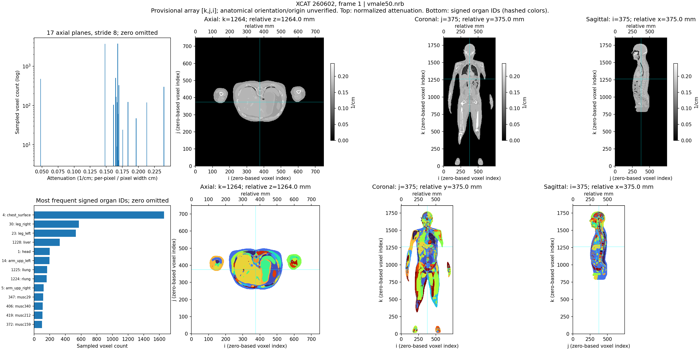

# XCAT source audit

Read-only stat of each direct case file. NumPy <f4 C-order memmaps; 17 evenly spaced axial planes, ji stride 8, frames 1/middle/last and averages. Estimates are samples, not exhaustive voxel statistics.

| Case | Organ model | Shape (k,j,i) | Spacing (mm) | Float32 volume GiB | Sample IDs frame 1 | Negative samples |
|---|---|---|---|---:|---:|---:|
| 260602 | vmale50.nrb | [1860, 750, 750] | [1.0, 1.0, 1.0] | 3.898 | 623 | 718 |
| 260611 | vfemale50.nrb | [1720, 690, 690] | [1.0, 1.0, 1.0] | 3.051 | 589 | 591 |
| 260612 | male_infant_ref.nrb | [1400, 554, 554] | [0.4, 0.4, 0.4] | 1.601 | 607 | 291 |
| 260613 | male_1yr_ref.nrb | [1640, 657, 657] | [0.5, 0.5, 0.5] | 2.637 | 658 | 329 |
| 260614 | male_5yr_ref.nrb | [1934, 782, 782] | [0.6, 0.6, 0.6] | 4.406 | 654 | 529 |
| 260615 | male_10yr_ref.nrb | [1838, 741, 741] | [0.8, 0.8, 0.8] | 3.760 | 573 | 435 |
| 260616 | male_15yr_ref.nrb | [1889, 763, 763] | [0.9, 0.9, 0.9] | 4.097 | 649 | 635 |
| 260617 | female_infant_ref.nrb | [1400, 554, 554] | [0.4, 0.4, 0.4] | 1.601 | 596 | 262 |
| 260618 | female_1yr_ref.nrb | [1640, 657, 657] | [0.5, 0.5, 0.5] | 2.637 | 650 | 321 |
| 260619 | female_5yr_ref.nrb | [1934, 782, 782] | [0.6, 0.6, 0.6] | 4.406 | 656 | 528 |
| 260620 | female_10yr_ref.nrb | [1838, 741, 741] | [0.8, 0.8, 0.8] | 3.760 | 572 | 437 |
| 260621 | female_15yr_ref.nrb | [1889, 763, 763] | [0.9, 0.9, 0.9] | 4.097 | 603 | 464 |

12 source anatomies; 612 paired motion frames; 1248 binary volumes including averages; 3672 ASCII mesh files.
Total apparent file size 4.301 TiB; allocated size 422.137 GiB (sparse volumes).

Sampling materialized 49.24 MiB total float32 values sequentially; sampled axial-plane spans sum to 3.040 GiB. Actual disk I/O depends on sparse allocation, paging, cache and read-ahead. Preview addresses up to 7.795 GiB of source files without creating full-volume copies. NFS orthogonal reads were considerably slower than axial sampling; cache previews or stage contiguous slabs on compute-node scratch.

## Input-contract implications

- Every binary file size agrees with x*y*(endslice-startslice+1)*4 bytes. Parameter/log geometry agrees for the audited cases. Float32 little endian gives meaningful sampled IDs; anatomical orientation/origin remain unverified.
- `.raw` files begin with organ names and ASCII triangle vertices. They are meshes, not voxel arrays.
- Dictionary coverage failed: 41 sampled signed IDs are absent from the supplied `organ_ids.txt`: [-830, -828, -827, -825, -824, -822, -821, -820, -817, -816, -814, -812, -806, -805, -802, 430, 431, 583, 584, 586, 871, 872, 873, 874, 875, 876, 877, 878, 879, 887, 1014, 1016, 1017, 1018, 1019, 1020, 1021, 1022, 1023, 1024, 1027]. Preserve those IDs and resolve their names/material grouping before promoting a cohort; do not silently map them to zero.
- With `color_code=1`, per-frame `act` volumes provide signed organ IDs. Preserve negative IDs, background 0, and an ID-to-name mapping. Organ names are not unique.
- `act_av` blends IDs across motion and has fractional values; it must not be accepted as a categorical segmentation.
- `atn` samples agree with the output log's attenuation-per-pixel table. Normalize by `pixel_width` in cm to obtain inverse-cm attenuation before comparing across resolutions. These values are not HU.
- Multiple organ IDs share one attenuation value. Use paired act IDs for anatomical selection and maintain a separate explicit tissue grouping. Intensity bins alone cannot isolate many organs.
- Split train/validation/test by source anatomy before emitting slices, frames, or geometry variants; 612 motion frames are not 612 independent subjects.
- A float32 volume is 1.60–4.41 GiB. Full-volume copies, displacement fields, distance maps, and TensorFlow training need separate memory budgets; use bounded ROI/chunk processing.
- Sampling validates representative data only. Full-volume finite/integer checks, signed-ID coverage, orientation landmarks, correspondence, and unchanged-exterior checks remain import acceptance gates.
- Preview coordinates are zero-based voxel indices and relative millimetres; patient left/right orientation and origin are not asserted.



## Validation scope

All input sizes and frame-presence checks cover the full case inventory. Finite/integer/dictionary checks cover only the declared deterministic samples. No full-volume checksum or anatomy-orientation validation was performed.

```json
{
  "all_binary_sizes_match": true,
  "all_par_log_geometry_agrees": true,
  "all_expected_frames_present": true,
  "all_sampled_values_finite": true,
  "all_sampled_frame_labels_integer": true,
  "all_sampled_frame_labels_in_organ_ids": false,
  "scope": "Size/completeness checks cover all named volumes; value checks cover only the declared samples."
}
```
